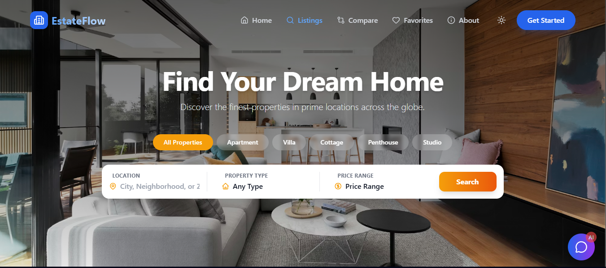
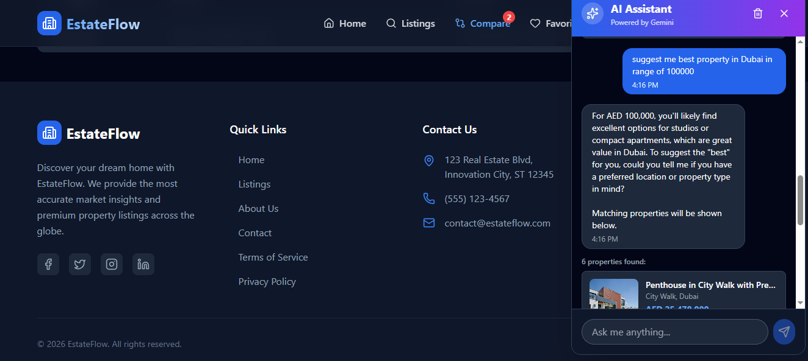
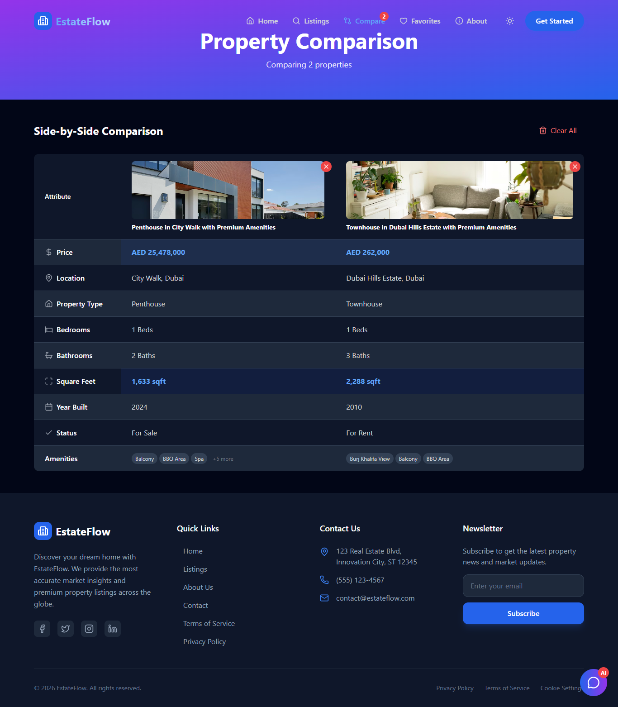

# EstateFlow – Premium Dubai Real Estate Dashboard

EstateFlow is a modern, AI-enabled real estate dashboard tailored for the Dubai property market. It focuses on performance, usability, and a premium user experience, enabling users to explore, compare, and analyze property listings with real-time data and intelligent assistance.

---

## 🚀 Live Demo

👉 **Live URL:** [https://estate-flow-ochre.vercel.app/](https://estate-flow-ochre.vercel.app/)

---

## 📸 Screenshots

### Home Dashboard


### Property Listings


### AI Property Assistant


### Property Comparison


---

## ✨ Features

- **🤖 AI-Powered Assistant**  
  - Integrated with **Google Gemini** to handle natural language queries, location-based searches, and personalized property recommendations.  
  - Supports conversational flows to refine requirements such as budget, location, bedroom count, and amenities.

- **🏠 Real-Time Dubai Listings**  
  - Uses the **Bayut Property API** via RapidAPI to fetch live, up-to-date property data for Dubai and across the UAE.  
  - Provides rich listing details including price, location, size, images, and key metadata.

- **💎 Premium User Interface**  
  - Built with **React 19**, **Tailwind CSS**, and **Framer Motion** to deliver smooth animations, responsive layouts, and a polished dashboard experience.  
  - Optimized for desktop viewing with adaptive behavior for various screen sizes.

- **⚖️ Property Comparison Tool**  
  - Compare multiple properties side by side by price, area, amenities, and other key attributes.  
  - Designed for investors and agents who need to evaluate several options quickly.

- **⚙️ Generative Data Engine**  
  - Includes a custom data generator for realistic demo properties, agents, and metadata using Faker.js.  
  - Ideal for demos, offline development, and showcasing features without relying solely on external APIs.

---

## 🛠️ Tech Stack

- **Framework:** React 19 + Vite  
- **Language:** TypeScript  
- **Styling:** Tailwind CSS  
- **Animations:** Framer Motion  
- **AI:** Google Gemini API  
- **Data Source:** Bayut Property API (via RapidAPI)  
- **Icons:** Lucide React  

---

## 🚦 Getting Started

### Prerequisites

- Node.js v18 or higher  
- npm (comes bundled with Node.js)

### Installation

1. **Clone the repository**
   ```bash
   git clone https://github.com/Hizbullah3698/EstateFlow.git
   cd EstateFlow/real-estate-dashboard
   ```

2. **Install dependencies**
   ```bash
   npm install
   ```

3. **Environment Configuration**
   Create a `.env` file in the `real-estate-dashboard` root directory and add your API keys:
   ```env
   VITE_RAPIDAPI_KEY=your_rapidapi_key_here
   VITE_RAPIDAPI_HOST=bayut.p.rapidapi.com
   VITE_GEMINI_API_KEY=your_gemini_api_key_here
   ```

   > [!TIP]
   > You can get your API keys from [RapidAPI (Bayut)](https://rapidapi.com/apidojo/api/bayut) and [Google AI Studio (Gemini)](https://aistudio.google.com/).

4. **Run the development server**
   ```bash
   npm run dev
   ```

---

## 📂 Project Structure

```text
src/
 ├── api/          # API integration and data generation logic
 ├── components/   # Reusable UI components
 ├── context/      # Global state (chat, favorites, comparison)
 ├── services/     # AI and external service integrations
 ├── pages/        # Application routes and main views
```

---

## 👨‍💻 Author

**Hizbullah** – Frontend Engineer  
[GitHub](https://github.com/Hizbullah3698)